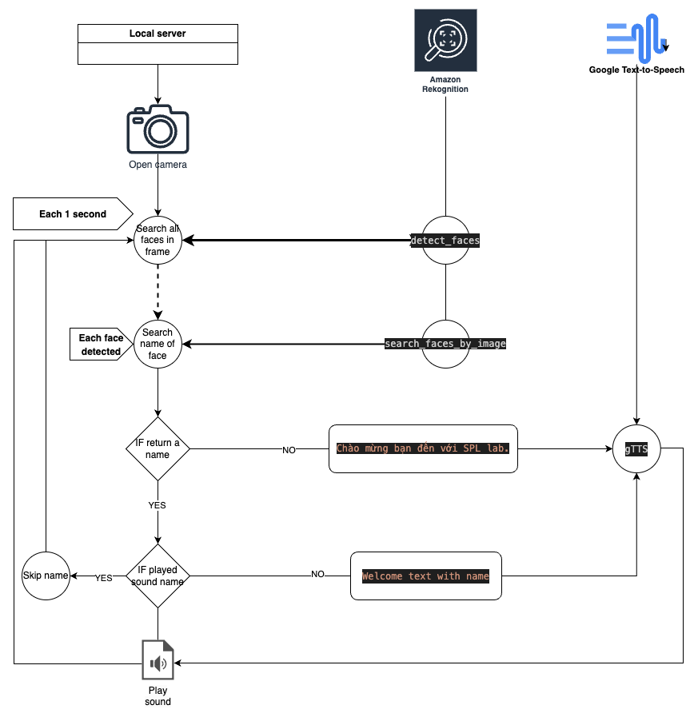

# Face Detection và Recognition với AWS Rekognition và Python

## Giới thiệu
Ứng dụng này sử dụng AWS Rekognition để nhận diện và nhận dạng khuôn mặt từ video trực tiếp từ webcam. Sau đó, nó sẽ phát ra lời chào dựa trên những khuôn mặt được nhận diện.

## Yêu cầu
- Python 3.x
- Cài đặt các thư viện sau bằng lệnh:
  ```bash
  pip install boto3 opencv-python-headless gtts pydub
  ```
## Cấu hình AWS Credentials:
Để sử dụng AWS Rekognition, bạn cần có AWS Credentials để xác thực. Các bước cài đặt AWS Credentials như sau:
    - Cài đặt AWS CLI trên máy tính của bạn.
    - Sử dụng lệnh để thiết lập AWS Access Key và Secret Access Key.
    - Nhập AWS Access Key, Secret Access Key, và region khi được yêu cầu.
```bash
aws configure
```

## Tạo Collection
Chạy file create_a_collection.py để tạo một Collection ID trên AWS Rekognition. Đây là bước cần thiết để lưu trữ các khuôn mặt đã đăng ký.
```bash
python create_a_collection.py
```
## Index Khuôn Mặt trong Dataset
Để đánh index các khuôn mặt trong một thư mục dataset, chạy file index_faces.py.
```bash
python index_faces.py
```
# Chạy ứng dụng
Để chạy ứng dụng nhận diện khuôn mặt từ webcam và phát ra lời chào, chạy file detect_face_and_play_2.py.
```bash
python detect_face_and_play_2.py
```
- Sau khi chạy, webcam của bạn sẽ được kích hoạt và bắt đầu nhận diện khuôn mặt từ video trực tiếp.
- Những khuôn mặt được nhận diện sẽ hiển thị trên màn hình cùng với lời chào phù hợp.
### Các lưu ý
- Chương trình sẽ lưu các hình ảnh của các khuôn mặt chưa được nhận diện vào thư mục images/ nếu không nhận diện được.
- Để kết thúc chương trình, nhấn q trong cửa sổ video.